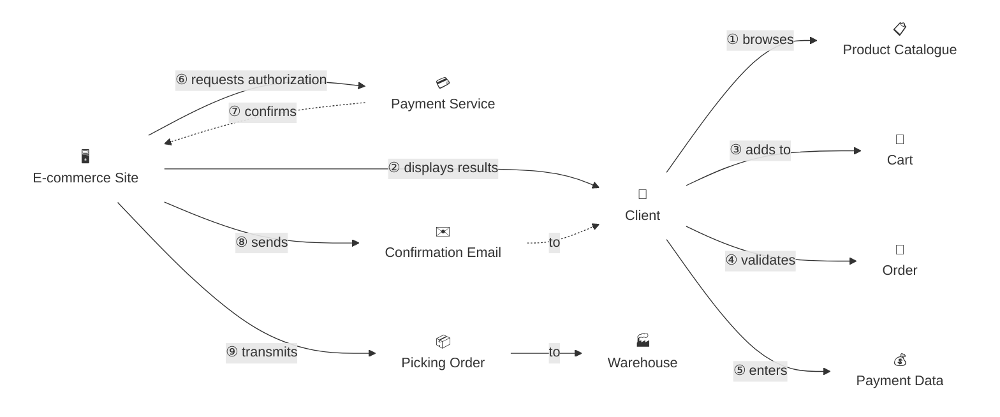

# Domain Storytelling Skills for Claude Code

A pair of [Claude Code](https://claude.ai/code) skills for **Domain Storytelling** following the Hofer & Schwentner methodology:

| Skill | What it does |
|-------|-------------|
| [`/create-domain-story`](#create-domain-story) | Elicits and documents the domain story (Markdown + Mermaid) |
| [`/domain-story-to-excalidraw`](#domain-story-to-excalidraw) | Draws the story as a visual Excalidraw diagram |

**Full DDD pipeline:**
```
/create-domain-story  →  /domain-story-to-excalidraw  →  event-storming
```

---

# create-domain-story

A skill for eliciting business processes as pictographic stories, building ubiquitous language, discovering bounded context candidates, and preparing for Event Storming.

---

## What is Domain Storytelling?

Domain Storytelling is a collaborative modeling technique where domain experts tell stories about how they work. Each story is built from three elements:

- **Actors** — people or systems involved (👤 🖥️ 🏭)
- **Work Objects** — data, documents, or items exchanged (📄 📋 📦)
- **Activities** — numbered arrows connecting actors and work objects (① ② ③)

Stories are told in the domain expert's language, not the developer's. This makes them the ideal foundation for **Domain-Driven Design**.

---

## Features

- **3 facilitation modes**: Interactive (guided), Quick (extract from narrative), Document (from existing docs)
- **AS-IS / TO-BE distinction**: captures current state or desired future state, never mixed
- **Boundary Discovery**: identifies bounded context candidates from vocabulary shifts and natural handoffs
- **Glossary building**: builds ubiquitous language with collision detection
- **Event Storming integration**: maps story elements to commands, events, and aggregates
- **Mermaid diagram**: directed graph with emoji icons and borderless nodes — matches pictographic notation

### Example output diagram



---

## Installation

### 1. Download the skill file

```bash
curl -o ~/.claude/skills/create-domain-story/SKILL.md \
  https://raw.githubusercontent.com/jguidoux/create-domainstory-skill/master/SKILL.md
```

Or clone the repo directly into your skills folder:

```bash
git clone https://github.com/jguidoux/create-domainstory-skill.git \
  ~/.claude/skills/create-domain-story
```

### 2. Verify installation

Restart Claude Code. The skill should appear in your available skills list. You can verify with:

```
/create-domain-story --help
```

> **Note:** Skills are loaded from `~/.claude/skills/` by default. If your Claude Code installation uses a different path, adjust accordingly.

---

## Usage

### Interactive Mode (recommended)

Best for live sessions with domain experts. Claude guides you phase by phase.

```
/create-domain-story --domain=order-management --as-is
```

Claude will ask you questions at each phase:
1. Scope and objective
2. Story narrative ("tell me what happens when...")
3. Edge cases and exceptions
4. Actor identification
5. Work object cataloging
6. Boundary discovery
7. Glossary building
8. Mermaid diagram generation
9. DDD integration and next steps

---

### Quick Mode

Best when you already know the process and want fast structured output. Provide your narrative directly.

```
/create-domain-story --domain=order-management --to-be --mode=quick
```

Then describe the process in plain language — Claude extracts actors, work objects, activities, boundaries, and glossary automatically.

**Example input:**
> "A customer searches the product catalogue, adds items to their cart, validates with delivery info. The system creates an order. The customer enters payment details, the system requests authorization from Stripe, which confirms. The system sends a confirmation email to the customer and a picking order to the warehouse."

---

### Document Mode

Best for retrofitting existing systems from documentation.

```
/create-domain-story --domain=order-management --as-is --mode=document
```

Claude reads existing files (specs, wikis, API contracts) and extracts the domain story from them.

---

## Output

Each run produces a structured Markdown file at:

```
reports/04_stories/[domain]_story.md
```

The file contains:

| Section | Content |
|---------|---------|
| **Narrative Summary** | 2-3 sentence plain language overview |
| **Story Sequence** | Numbered activities ①②③ in prose |
| **Actors** | Table with type and responsibilities |
| **Work Objects** | Table with creator, consumer, description |
| **Annotations** | Implicit knowledge and exceptions |
| **Boundary Discovery** | Bounded context candidates with rationale |
| **Glossary** | Ubiquitous language with collision detection |
| **Mermaid Diagram** | Directed graph (`graph LR`) |
| **DDD Next Steps** | Domain events, bounded contexts, recommended next skill |

---

## DDD Workflow Integration

This skill fits into a broader DDD workflow:

```
/create-domain-story    →   understand "what happens"
        ↓
  event-storming        →   design "how it happens"
        ↓
  /ddd-redesign         →   define bounded contexts
        ↓
modular-architecture    →   implement the architecture
```

Story elements map to Event Storming artifacts:

| Story Element | Event Storming |
|---|---|
| Activity | Command or Domain Event |
| Work Object | Aggregate or Read Model |
| Actor | Actor (yellow sticky) |
| Boundary | Bounded Context candidate |

---

## Related Skills

| Skill | Purpose |
|-------|---------|
| `/domain-story-to-excalidraw` | **Companion skill** — draw this story on Excalidraw (next step) |
| `event-storming` | Design "how it happens" after storytelling |
| `/analyze-system` | Extract actors and ubiquitous language as input |
| `/ddd-redesign` | Redesign bounded contexts |
| `modular-architecture` | Implement discovered bounded contexts |
| `adr-management` | Document decisions from storytelling sessions |

---

# domain-story-to-excalidraw

Reads a Domain Story file produced by `/create-domain-story` and draws it on the [Excalidraw](https://excalidraw.com) canvas using the pictographic Domain Storytelling notation.

## Features

- **Auto emoji assignment** — matches actor/work object names to emoji icons by keyword
- **Auto color coding** — actors get distinct colors by order of appearance; work objects are gray
- **Bound arrows** — arrows stay connected to elements when moved
- **Drift fix built-in** — automatically corrects Excalidraw's emoji repositioning bug after arrow creation
- **PNG export** — saves the diagram to `reports/04_stories/[domain]_story.png`
- **Boundary zones** (optional) — adds semi-transparent zones for bounded context candidates

## Prerequisites

The Excalidraw MCP server must be running:

```bash
cd /path/to/mcp_excalidraw
PORT=3000 npm run canvas
```

Then open `http://localhost:3000` in your browser.

## Installation

```bash
curl -o ~/.claude/skills/domain-story-to-excalidraw/SKILL.md \
  https://raw.githubusercontent.com/jguidoux/create-domainstory-skill/master/domain-story-to-excalidraw/SKILL.md
```

## Usage

Run `/create-domain-story` first, then:

```
/domain-story-to-excalidraw --file=reports/04_stories/ecommerce-commande_story.md
```

The skill will:
1. Parse the story file (actors, work objects, numbered activities)
2. Assign emojis and colors automatically
3. Calculate the layout
4. Draw everything on the canvas
5. Fix the emoji drift bug
6. Take a screenshot for review
7. Export to PNG

---

## References

- [Domain Storytelling](https://domainstorytelling.org) — official site by Hofer & Schwentner
- [Domain Storytelling (book)](https://www.domaindriven.de/domainstorytelling) — Stefan Hofer & Henning Schwentner

---

## License

MIT
