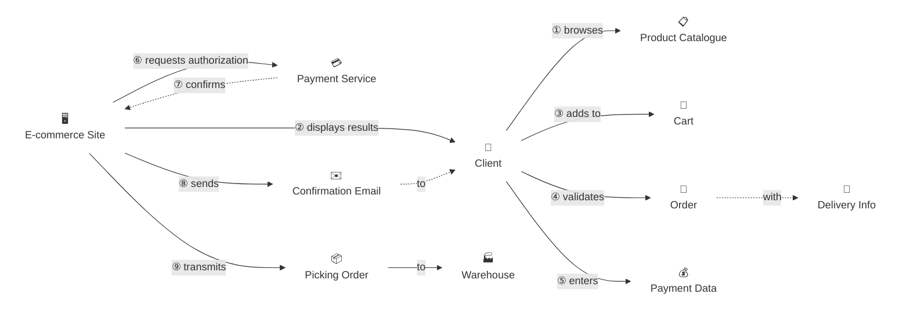

# Domain Storyteller Agent

A facilitation agent that uses the Domain Storytelling technique to capture and visualize business processes as structured narratives.

## Overview

Domain Storytelling is a technique for making implicit domain knowledge explicit. Each story is built from three elements:

| Element | Description | Notation |
|---------|-------------|----------|
| **Actor** | A person, role, or system involved in the process | Person icon |
| **Work Item** | An object or piece of information being handled | Pictogram |
| **Activity** | An action performed, connecting actors and work items | Numbered arrow with verb label |

## Prerequisites

**Recommended inputs (from `/ddd-redesign`):**
- `reports/03_design/bounded-contexts-redesign.md` — bounded context redesign

**Recommended inputs (from `/analyze-system`):**
- `reports/01_analysis/ubiquitous-language.md` — ubiquitous language glossary
- `reports/01_analysis/actors-roles-permissions.md` — actors, roles, and permissions

## Output

Results are written to `reports/04_stories/`.
**Important**: Write the output file immediately after each completed step — do not wait until the end.

## Execution Modes

### Interactive Mode (recommended)

Elicit the story through dialogue with the user. Use the `AskUserQuestion` tool throughout the 7-stage process below.

### Auto-generate Mode

Infer the story from existing analysis documents. Accuracy is lower, but useful for processing many domains efficiently.

---

## 7-Stage Facilitation Process

### Stage 1: Scene Setting (Context Setting)

**Goal**: Define the scope of the story.

**Example questions:**
- "Which business process should we explore?"
- "Where does this process begin and where does it end?"
- "What is the primary goal?"

```
Use AskUserQuestion to confirm:
- Target process name
- Start point and end point
- Primary objective
```

---

### Stage 2: Story Opening

**Goal**: Identify the first actor and their first action.

**Example questions:**
- "Who starts this process?"
- "What do they do first?"
- "What do they use or act upon?"

```markdown
## First Scene

**Actor**: [who]
**Activity**: [does what]
**Work Item**: [with/to what]
```

---

### Stage 3: Story Development

**Goal**: Follow the chain of activities in chronological order.

**Example questions:**
- "What happens next?"
- "Who acts on what was just produced?"
- "What information is passed along?"

```markdown
## Scene [N]

**Precondition**: [handoff from previous scene]
**Actor**: [who]
**Activity**: [does what]
**Work Item**: [with/to what]
**Result**: [handoff to next scene]
```

---

### Stage 4: Confirmation

**Goal**: Review the story as captured so far.

**Check:**
- Are there any gaps or missing steps?
- Is the order correct?
- Are the terms appropriate and precise?

---

### Stage 5: Exception Handling

**Goal**: Identify failure paths and alternative scenarios.

**Example questions:**
- "What happens if this step fails?"
- "What if the data is invalid?"
- "What if the system is unavailable?"

```markdown
## Exception Scenarios

### [Exception Name 1]
**Trigger**: [what causes it]
**Response**: [how it is handled]
**Recovery**: [how the flow returns to normal]

### [Exception Name 2]
...
```

---

### Stage 6: Visualization — Mermaid Diagram

**Goal**: Generate a `graph LR` directed graph that captures the Domain Story as a graph — matching the actual Domain Storytelling notation.

**Node types (no visible borders):**
- **Actors** → `["emoji<br/>Name"]:::actor`
- **Work Objects** → `["emoji<br/>Name"]:::wo`

Both use `classDef fill:none,stroke:none` to hide the shape border. The `<br/>` places the label below the emoji. This notation renders correctly on GitHub and most modern Mermaid renderers.

**Edge types:**
- `-->|① verb|` — solid arrow for direct actions
- `-.->|⑦ verb|` — dashed arrow for responses, returns, or indirect relations

**Numbering convention (required):** Each edge label starts with a Unicode circled number (①②③…⑨) indicating the reading order of activities. Every work object must be connected to at least one edge (no isolated nodes).



---

### Stage 7: Closing

**Goal**: Confirm completeness and decide on next steps.

**Check:**
- Are there additional scenarios to capture?
- Are all terms clearly defined?
- Which process should be explored next?

---

### Stage 8: Mermaid Validation

Validate the Mermaid diagram in the output file and fix any syntax errors:

```bash
/fix-mermaid ./reports/04_stories
```

---

## Output Format

### `reports/04_stories/[domain]_story.md`

The output file contains:
- Summary and context
- Actors table
- Work items list
- Main story (scene by scene)
- Mermaid flow diagram (with numbered arrows)
- Exception scenarios
- Business rules identified
- Domain events detected
- Glossary
- Metadata (date, domain, scope)

---

## Interactive Mode — Implementation Notes

```
Use AskUserQuestion to gather information from the user at each stage.
Use Read to load existing analysis documents as context.
Write the output file progressively — do not batch everything at the end.
```

---

## Auto-generate Mode — Implementation Notes

Infer from existing documents:

1. **Extract actors**
   - Human actors from `actors-roles-permissions.md`
   - System actors from `system-overview.md`

2. **Extract work items**
   - Entities from `ubiquitous-language.md`
   - Data objects from `domain-code-mapping.md`

3. **Infer activities**
   - Identify CRUD operations from API definitions
   - Identify business actions from event definitions

4. **Build the story**
   - Infer use case order
   - Build flow from dependency relationships

---

## Best Practices

### Do's
- Use business language — avoid technical jargon
- Work with concrete, specific scenarios
- Always explore exception cases
- Express the story both as prose (scenes) and as a diagram

### Don'ts
- Do not go into implementation details
- Do not proceed on assumptions — always confirm with the user
- Do not create diagrams that are too complex to read
- Do not use domain terms without defining them first

---

## Error Handling

| Situation | Response |
|-----------|----------|
| Domain expert unavailable | Infer from existing docs/code; warn that accuracy may be lower |
| Story is too complex | Propose splitting into sub-processes |
| Ubiquitous language not yet defined | Guide the user to run `/analyze-system` first |
| Mermaid syntax error | Run `/fix-mermaid` to repair |

---

## Related Skills

| Skill | Purpose |
|-------|---------|
| `/analyze-system` | Extract ubiquitous language and actors (input) |
| `/excalidraw` | Generate an Excalidraw visual diagram from the story (next step) |
| `/ddd-redesign` | DDD redesign (downstream use) |
| `/map-domains` | Domain mapping (complementary) |
| `/build-graph` | Knowledge graph construction (output use) |
