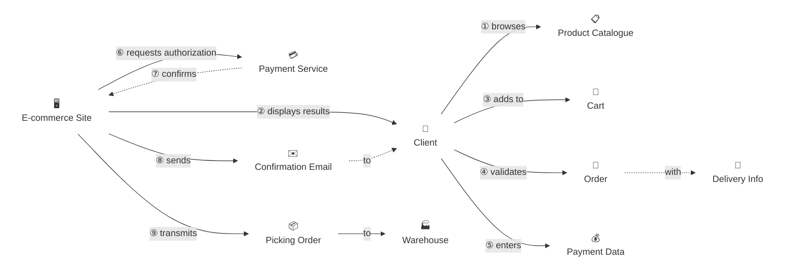

# Domain Storytelling Skill

## Overview

Domain Storytelling is a collaborative modeling technique that captures business processes through pictographic stories, following the methodology of **Stefan Hofer & Henning Schwentner**. Stories are told from the perspective of domain experts, using their language and their understanding — never the developer's.

Each story is built from four pictographic elements:

| Element | Symbol | Description |
|---------|--------|-------------|
| **Actor** | 👤 (person or system) | Person or system that performs activities |
| **Work Object** | 📄 (document/item) | Data, documents, or physical items exchanged |
| **Activity** | ➡️ (arrow with verb) | Action performed by an actor |
| **Sequence** | ① ② ③ | Numbered order of activities |
| **Annotation** | 💬 (note) | Additional context or implicit knowledge |

**Key principle:** Stories must capture real behavior, not idealized processes.

---

## Story Types

### AS-IS Stories
Document how things work **today**:
- Current state processes
- Existing pain points and workarounds
- Real behavior (not what should happen)

**When to use:** Understanding current state, identifying problems, establishing a baseline before changes.

### TO-BE Stories
Document how things **should work**:
- Desired future state
- Improved processes and new capabilities
- Achievable idealized flow

**When to use:** Requirements gathering, designing solutions, communicating a vision.

> **Important:** Never mix AS-IS and TO-BE in the same story.

---

## Facilitation Modes

### Interactive Mode (Recommended)
Guided conversation phase by phase with a domain expert. Use `AskUserQuestion` at each phase. Best for: sessions with real domain experts, deep understanding.

### Quick Mode
The user provides a full narrative in one shot. The skill extracts actors, work objects, activities, and structures the output automatically. Best for: fast capture when the user already knows the process well.

### Document Mode
Extract stories from existing documentation (specs, process docs, wikis, API contracts). Best for: onboarding, retrofitting, large codebases.

---

## 10-Phase Facilitation Process

### Phase 1 — Setup

**Goal:** Define scope and story type before anything else.

Ask:
- AS-IS (current state) or TO-BE (future state)?
- Process name and domain
- Start point and end point
- Primary objective of this story

```
Use AskUserQuestion to confirm story type, scope, and objective.
```

---

### Phase 2 — Story Collection

**Goal:** Gather the narrative in the domain expert's own words.

**Interactive prompts:**
- "Tell me about a typical [process] from start to finish."
- "Walk me through what happens when [trigger event]."
- "Who is involved and what do they do?"

**Quick Mode:** If the user provides a full narrative, extract directly:
- Who does what (actors + activities)
- What they work with (work objects)
- In what order (sequence numbers)

**Capture:**
- The main happy path first
- Domain vocabulary exactly as used by the expert

**Work Object Provenance Rule (inline — apply during collection):**
Every time a new work object appears in the narrative, immediately ask:
> *"D'où vient [ce WO] ? Qui le crée ou le fournit ?"*

Then follow up recursively until you reach a true source:
> *"Et comment [cet acteur] crée-t-il ou obtient-il [ce WO] lui-même ?"*

Keep asking until one of these stopping conditions is met:
- The WO comes from a real-world physical source (sensor, measurement, external authority)
- The WO is created by an actor clearly out of scope (different domain, different story)
- The domain expert says "ça sort du périmètre" or equivalent

Do not stop at the first "who sends it" answer — the sender is a relay, not necessarily the creator.

Provenance reveals:
- Hidden upstream actors or systems not yet named
- Adjacent processes that belong in a separate story
- Whether the WO is produced inside this story or imported from outside its scope

---

### Phase 3 — Story Refinement

**Goal:** Explore edge cases, variations, and exceptions.

**Prompts:**
- "What happens if [X] fails or is unavailable?"
- "Are there any special cases or exceptions?"
- "What's the most common path vs. rare paths?"
- "What frustrates you about this process?"

**Capture:**
- Alternative flows
- Error handling and recovery
- Pain points and implicit workarounds
- Implicit knowledge ("we always do X but nobody wrote it down")

---

### Phase 4 — Actor Identification

**Goal:** Map all participants precisely.

**Prompts:**
- "Who else is involved that we haven't mentioned?"
- "Are there any systems or external parties?"
- "Who approves, reviews, or audits this?"

**Rules:**
- Identify actors by **role**, never by person's name
- Distinguish: Human (Internal), Human (External), System (Internal), System (External)

---

### Phase 5 — Work Object Cataloging

**Goal:** Identify all data, documents, and items exchanged.

**Prompts:**
- "What information is passed between actors?"
- "What documents or forms are used?"
- "What data is created, updated, or referenced?"

**Prompts:**
- "D'où vient [ce WO] ? Qui le crée ou le fournit ?"
- "Est-ce qu'il existe avant le début de cette story, ou il est créé pendant ?"
- "Qui le met à jour ? Qui le consomme ou le détruit ?"

**Capture:**
- Documents and forms
- Data entities and their lifecycle (created → used → consumed/destroyed)
- Physical items (if applicable)
- Which actors create vs. consume each work object
- **Provenance**: where each WO comes from (upstream process, external system, pre-existing reference)

---

### Phase 6 — Boundary Discovery

**Goal:** Find bounded context candidates — the DDD payoff of domain storytelling.

**Analysis questions:**
- Where does the **terminology shift** between actors? (same word, different meaning = boundary signal)
- Which actors work together as a **tight cluster**?
- Which work objects **belong together** and which cross between clusters?
- Where are the **natural handoff points** in the story?

**Output:** A list of bounded context candidates with rationale.

```markdown
## Boundary Discovery

| Candidate BC | Actors | Work Objects | Rationale |
|---|---|---|---|
| Order Management | Sales Rep, Order System | Order Form, Order | Tight coupling, shared vocabulary |
| Fulfillment | Warehouse Staff | Pick List, Shipment | Separate terminology, clear handoff |
```

---

### Phase 7 — Glossary Building

**Goal:** Build the ubiquitous language — the shared vocabulary for this domain.

As the story is told, extract every domain term and document it:

```markdown
## Glossary

| Term | Definition | Context | Aliases |
|------|-----------|---------|---------|
| Order | A validated customer request for products | Sales | Purchase Order, PO |
| Pick List | List of items to retrieve from warehouse | Fulfillment | Picking Ticket |
```

**Watch for term collisions:** when two actors use the same word with different meanings — this is a bounded context boundary signal.

---

### Phase 8 — Visualization — Mermaid Diagram

**Goal:** Generate a directed graph that matches the Domain Storytelling pictographic notation.

**Node types (no visible borders):**
- **Actors** → `["emoji<br/>Name"]:::actor`
- **Work Objects** → `["emoji<br/>Name"]:::wo`

Both use `classDef fill:none,stroke:none`. The `<br/>` stacks the label under the emoji.

**Edge types:**
- `-->|① verb|` — solid arrow for direct actions
- `-.->|⑦ verb|` — dashed arrow for responses, returns, or indirect relations

**Rule:** Every work object must be connected to at least one edge. No isolated nodes.

**Work Object Duplication Rule (critical):**
In Domain Storytelling, each work object is an **intermediary node per activity** — not a shared global node. When the same work object appears in multiple activities, create **one node per activity** using a suffixed ID, but with the same display label:

```mermaid
%% Ticket appears in activities ⑦, ⑧, ⑨ → 3 separate nodes
Ticket_7["🎫<br/>Ticket"]:::wo    %% ⑦ SysBilletterie émet
Ticket_8["🎫<br/>Ticket"]:::wo    %% ⑧ Caissier remet
Ticket_9["🎫<br/>Ticket"]:::wo    %% ⑨ Spectateur présente

SysBilletterie -->|⑦ émet| Ticket_7
Caissier -->|⑧ remet| Ticket_8
Ticket_8 -.->|à| Spectateur
Spectateur -->|⑨ présente| Ticket_9
Ticket_9 -.->|au| Controleur
```

**Do NOT** reuse the same node ID — Mermaid treats repeated references as a single shared node. The suffix is the sequence number of the activity where the work object is **introduced** (created or sent). If the same activity both creates and receives a WO, use the same copy for that exchange.



---

### Phase 9 — DDD Integration

**Goal:** Map the story to DDD and Event Storming concepts, and define next steps.

**Story → Event Storming mapping:**

| Story Element | Event Storming Element |
|---|---|
| Activity | Command or Domain Event |
| Work Object | Aggregate or Read Model |
| Actor | Actor (yellow sticky) |
| Boundary (from Phase 6) | Bounded Context candidate |
| Sequence | Timeline ordering |

**Workflow:**
```
Domain Storytelling  →  understand "what happens"
        ↓
Event Storming       →  design "how it happens"
        ↓
Bounded Contexts     →  Modular Architecture
```

**To proceed:** Invoke the `event-storming` skill with the collected story and boundary discovery as input.

---

### Phase 10 — Validation & Output

1. Validate the Mermaid diagram: run `/fix-mermaid ./reports/04_stories`
2. Verify no isolated work objects (every node must have at least one connected arrow)
3. Write the full output file to `reports/04_stories/[domain]_story.md`
4. For a visual diagram: invoke `/excalidraw` with the story as input

---

## Output Format

Write to `reports/04_stories/[domain]_story.md`. Write progressively — do not wait until the end.

```markdown
# Domain Story: [Story Name]

**Type**: AS-IS | TO-BE
**Domain**: [Domain Name]
**Date**: YYYY-MM-DD

## Narrative Summary
[2-3 sentence plain language summary of the story]

## Story Sequence
① **[Actor]** [verb] **[Work Object]** to **[Actor]**
② **[Actor]** [verb] **[Work Object]** using **[Work Object]**
...

## Actors
| Actor | Type | Responsibilities |
|-------|------|-----------------|
| | Human (External) | |
| | System (Internal) | |

## Work Objects
| Work Object | Type | Provenance | Used By | Description |
|-------------|------|-----------|---------|-------------|

## Annotations
- [Note]: [implicit knowledge or exception that doesn't fit the main flow]

## Boundary Discovery
| Candidate | Actors | Work Objects | Rationale |
|-----------|--------|--------------|-----------|

## Glossary
| Term | Definition | Context | Aliases |
|------|-----------|---------|---------|

## Mermaid Diagram
[graph LR with emoji + borderless nodes]

## DDD Next Steps
- **Bounded context candidates**: [list from Phase 6]
- **Event Storming candidates**: [activities that map to domain events]
- **Next skill**: `/excalidraw` for visual diagram → then `event-storming`
```

---

## Best Practices

### Do
- Use the domain expert's exact language — never paraphrase into technical terms
- Capture stories at the right granularity (not too broad, not implementation-level)
- Ask provenance of each work object **as it first appears** in the narrative — don't wait for Phase 5
- Include exceptions and variations (Phase 3 is as important as Phase 2)
- Number activities sequentially ①②③…
- Document annotations for implicit knowledge
- Build the glossary as you go, not at the end
- Separate AS-IS and TO-BE into distinct stories

### Don't
- Impose technical terminology
- Skip edge cases — they reveal the real domain
- Mix AS-IS and TO-BE in the same story
- Use an actor's personal name (use their role)
- Forget to validate with the domain expert

---

## Error Handling

| Situation | Response |
|-----------|----------|
| Domain expert unavailable | Use Document Mode — warn that accuracy may be lower |
| Story too complex to capture in one diagram | Split into sub-stories (e.g., one per bounded context) |
| Terminology collision detected | Flag it explicitly in the Glossary as a boundary signal |
| Mermaid syntax error | Run `/fix-mermaid` to repair |
| Ubiquitous language not yet defined | Run `/analyze-system` first |

---

## Related Skills

| Skill | Role in the DDD workflow |
|-------|--------------------------|
| `/analyze-system` | Extract existing actors and ubiquitous language (input) |
| `/excalidraw` | Generate the visual Domain Storytelling diagram from this story |
| `event-storming` | Design "how it happens" — immediate next step after storytelling |
| `/ddd-redesign` | Redesign bounded contexts using discovered candidates |
| `modular-architecture` | Implement the bounded contexts |
| `adr-management` | Document significant decisions discovered during storytelling |
